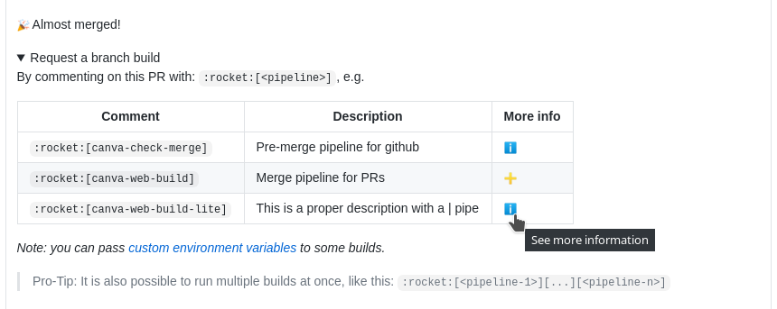

# 🚀🤖 Rocketbot


This lambda provides a bridge between github and Buildkite, allowing you to trigger a Buildkite build from a comment on a pull request on github.

In its simplest form it can be used like this:

```markdown
:rocket:[buildkite-pipeline-slug]
```

## Passing custom environment variables

Since version 2 it is also possible to pass custom environment variables to the build:

````markdown
:rocket:[buildkite-pipeline-slug]

```ini
MY_VAR=value
another_one=bla
QUOTED_VAR="Some quoted value"
```
````

which would kick off a build of the pipeline `buildkite-pipeline-slug` with the environment variables

```ini
GH_CONTROL_USER_ENV_MY_VAR="value"
GH_CONTROL_USER_ENV_another_one="bla"
GH_CONTROL_USER_ENV_QUOTED_VAR="Some quoted value"
```

Note: `ini` behind the markdown code block is optional if you want to save a few seconds when typing :)

## Kicking off multiple builds in one command

Since version `3.1.0` it is possible to kick off multiple builds with one command:

```markdown
:rocket:[buildkite-pipeline-slug][buildkite-pipeline-slug-2][buildkite-pipeline-slug-...][buildkite-pipeline-slug-n]
```

or:

```markdown
:rocket:[buildkite-pipeline-slug]
:rocket:[buildkite-pipeline-slug-2]
:rocket:[buildkite-pipeline-slug-...]
:rocket:[buildkite-pipeline-slug-n]
```

or any combination thereof.

## Adding or viewing documentation for pipelines

`github-control` leaves a comment on PRs similar to the following:



Adding or viewing documentation for a pipeline can be achieved by clicking :heavy_plus_sign: or :information_source:, respectively. The default location for documentation is `https://github.com/${repo_slug}/blob/${pr_head_sha}/.buildkite/pipeline/description/${buildkite_org_slug}/${buildkite_pipeline_slug}.md`. This location can be overridden by defining the `GH_CONTROL_README_URL` environment variable of the pipeline you want to document. The value of the environment variable supports templating with the following variables:

- `COMMITISH`
- `ORG`
- `REPO`

For example, setting `GH_CONTROL_README_URL=https://github.com/$ORG/$REPO/blob/$COMMITISH/path/to/README.md` would be equivalent to something like `GH_CONTROL_README_URL=https://github.com/some-org/some-repo/blob/c0ffee/path/to/README.md`.

## Development

You need to run this with the version of node that Lambda supports. At the moment this is `12.x` and `14.x`, so you need to get a node version manager, e.g.:

```bash
yarn global add n
n 12
```

and then you can run the tests as usual with `yarn test` or kick them in watch mode via `yarn test:watch`.

### Debugging hints

Use `ENABLE_DEBUG=true DEBUG=nock.* yarn test:watch` and `.only` in the tests to see output and assertions from nock.
