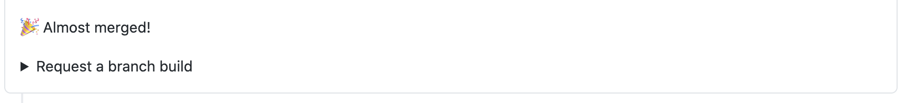

# Getting started

In this guide, you'll learn how to:

- Display the list of RocketBot builds available for your PR.
- Run a RocketBot build.

## Display the builds available for your PR

When you create a PR, the `github-control` GitHub user leaves an **Almost merged!** comment on your PR.



To see a list of the RocketBot-enabled builds available for your PR, click **Request a branch build**.


Each repository has its own unique list of available builds, dependending on which Buildkite pipelines were marked explicitly as a RocketBot build.

> Please keep in mind: Marking pipelines explicitly is not mandatory, RocketBot allows triggering any pipeline. It will use the credentials it has been configured with, so if the credentials are valid to trigger a pipeline, kicking off a RocketBot build will work.

## Run a build

To run a RocketBot build, enter it as a comment on your PR.

```
:rocket:[buildkite-pipeline-slug]
```

Where `[buildkite-pipeline-slug]` is the Buildkite continuous integration (CI) pipeline build to run.

You can also run multiple builds from the one comment. Either:

```
:rocket:[buildkite-pipeline-slug-1][buildkite-pipeline-slug-2][...][buildkite-pipeline-slug-n]
```

or:

```
:rocket:[buildkite-pipeline-slug-1]
:rocket:[buildkite-pipeline-slug-2]
:rocket:[buildkite-pipeline-slug-...]
:rocket:[buildkite-pipeline-slug-n]
```

### GitHub saved replies

As a convenience, you can save your most commonly used RocketBot builds as GitHub saved replies, then quickly select and submit them into your PR.

#### Create GitHub saved replies

To create a GitHub saved reply:

1. In the upper-right corner of any GitHub page, select your profile photo, then select **Settings**.
1. In the left sidebar, select **Saved replies**.

   

1. In **Saved reply title** field, enter a title for your reply. For example, `trigger my-pipeline`.
1. In the **Write** tab, enter your RocketBot build command.

   

1. Select **Add saved reply**.

#### Use GitHub saved replies

To use a GitHub saved reply:

1. In the comment field for your PR, select .
1. Select a saved reply from the list.

   

1. Select **Comment**.

## Next steps

After you've learned how to display and run RocketBot builds for your PR, see the following additional sources of information:

- [Install and configure RocketBot](./guides/install-and-configure.md).
- [Set up a repository to work with RocketBot](./guides/setup-repository-for-rocketbot.md).
- [Pass variables to your RocketBot builds](./guides/pass-in-variables.md).
- [View or add documentation for RocketBot builds](./guides/view-add-build-documentation.md).
- [Test the Lambda function and API](./guides/test-lambda-api.md).
- [View the variables available to any RocketBot build](./reference/variables.md).
- [RocketBot development and releasing](./guides/development-and-releasing.md).
