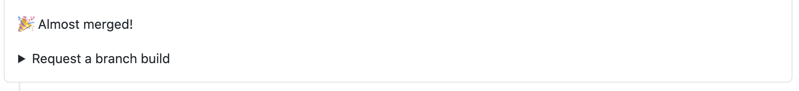
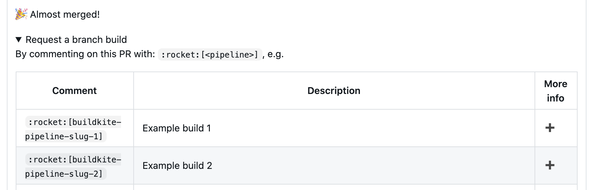

# View or add build documentation

In this guide you'll learn how to view or add documentation for the RocketBot builds for your PR.

When you create a PR, the RocketBot GitHub user leaves an **Almost merged!** comment on your PR.

To see a list of the RocketBot builds available for your PR, click **Request a branch build**.

In the **More info** column for each RocketBot build there's an information icon or a plus icon. If a build has an information icon, you can select it to view the related documentation for the build. If a build has a plus icon, you can follow the steps below to add documentation for the build.

The default documentation location is `https://github.com/${some_repo}/blob/${pr_head_sha}/.buildkite/pipeline/description/${buildkite_org_slug}/${buildkite_pipeline_slug}.md`. You can override this location by defining the `GH_CONTROL_README_URL` environment variable for the pipeline you want to document. The value of the environment variable supports the following variables:

- COMMITISH
- ORG
- REPO

For example, setting `GH_CONTROL_README_URL=https://github.com/$ORG/$REPO/blob/$COMMITISH/path/to/README.md` is equivalent to something like `GH_CONTROL_README_URL=https://github.com/some-org/some-repo/blob/c0ffeec0ffeec0ffee/path/to/README.md`.

To add documentation for a RocketBot build:

1. Select the plus icon for the RocketBot build you want to add documentation for.
1. Add your documentation to the Markdown file that opens.
1. Commit the file.
